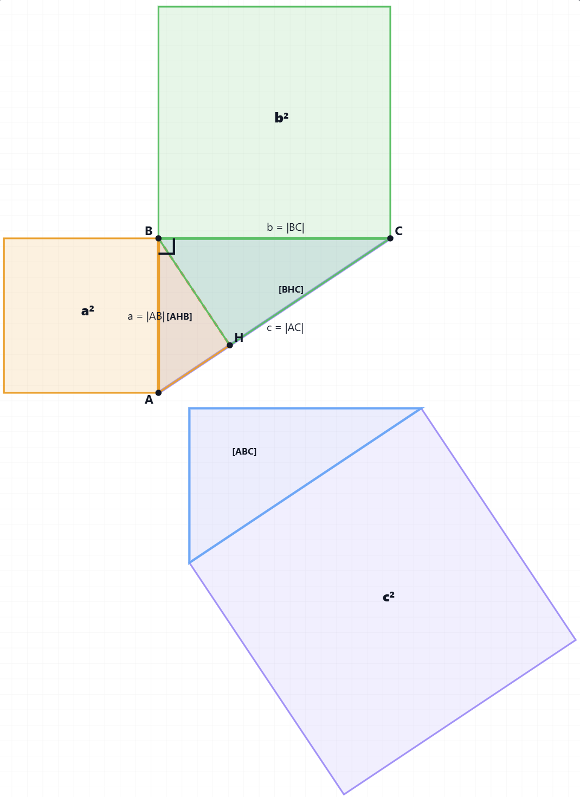

# A short visual proof of the Pythagorean Theorem

([an animated version](https://michalkonecny.github.io/pythagoras_visual_mini_proof/),
[a detailed version](./proof-gpt5mini.md))

1. Assume a right-angled triangle $\triangle ABC$ with the right angle at vertex $B$.
2. Let $H$ be the foot of the perpendicular from $B$ to the hypotenuse $AC$.
3. The two smaller triangles partition the larger triangle, which means their areas sum to the area of the whole: $[\triangle ABC] = [\triangle AHB] + [\triangle BHC]$.
4. Now $\triangle ABC$ is similar to $\triangle AHB$ and also to $\triangle BHC$:
    - $△ABC \sim △AHB$ since they share angle A, and both have right angles
    - $△ABC \sim △BHC$ since they share angle C, and both have right angles
5. The ratio of the area $[\triangle ABC]$ to $|AC|^2$ is the same as the ratio of $[\triangle AHB]$ to $|AB|^2$, as well as the ratio of $[\triangle BHC]$ to $|BC|^2$ since:
    - For similar triangles, the ratio of areas equals the square of the ratio of corresponding sides.
6. Using these ratio equalities, the equation from step 3 translates to $|AC|^2 = |AB|^2 + |BC|^2$.

